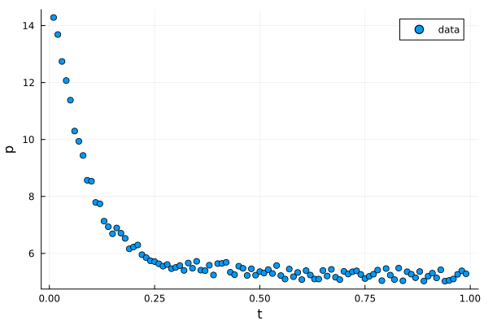

# Homework Assignment 18


During a single-phase one-dimensional core flooding experiment, pressure readings were observed at 99 evenly spaced points in the interior of a core. The pressure as a function of $x$ observations are stored in the data file [data.csv](./data/data.csv) and shown in the figure below



The left essential boundary condition is $p(0) = 15$ and the right essential boundary condition is $p(1) = 5$. 

You job is find the unknown parameters $\theta_1$ and $\theta_2$ from a proposed mobility function of the form

$$
\lambda(x) = x^{\theta_1} + \theta_2
$$

You can use the [Gripap.jl](https://gridap.github.io/Gridap.jl/stable/) finite element solution from [Assignment 17](https://github.com/PGE383-HPC/assignment17) to solve the forward problem.

A useful package for solving the inverse problem is [Optimisers.jl](https://fluxml.ai/Optimisers.jl/dev/).  You'll need to be able to compute the gradient of a loss function with respect to the unknown parameters $\theta_1$ and $\theta_2$.  Unfortunately, you cannot (currently) use automatic differentiation with Gridap; however, you can always use finite difference approximations to compute gradients.  A nice package for computing finite differences in Julia is [FiniteDifferences.jl](https://juliadiff.org/FiniteDifferences.jl/latest/).

Implement your solution in the [assignment18.jl](src/assignment18.jl) file; specifically, your job is to complete the function `train(filename::String, nepochs::Integer=5000, tolerance::Real= 5, θ::Vector{<:Real}=[1.0, 0.1])` where `filename` is the path to [data.csv](data/data.csv), `nepochs` is the maximum number of training iterations, `tolerance` is the loss function tolerance to stop the training iterations, and `θ` is the initial guess for the unknown parameters.  The loss function has already been provided in the function `loss()`.


## Testing

To see if your answer is correct, run the following command at the Terminal
command line from the repository's root directory

```bash
julia --project=. -e "using Pkg; Pkg.test()"
```

the tests will run and report if passing or failing.
